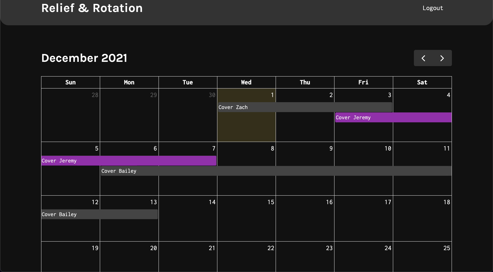

# Relief and Rotation

   [](./LICENSE)
## Description

Live Website: https://www.reliefandrotations.com

Relief and rotations is a Web App utility for managing employee scheduling.  The app was built using the MERN stack and deployed via Heroku and also on a dedicated server at www.reliefandrotations.com.  The Idea revolves around simplicity.  Three user catagories interact with each other in order to produce and maanipulate data on a central, companywide calendar.  The calendar displays requests for time off or "relief" in a pending and approved state.  The three categories of users are: Administrator, relief, and employee.  Our app makes use of roles in order toa sign functioanlity to one that the other would not get.  More features are yet to come!

## Table of Contents:
* [Installation](#installation)
* [Usage](#usage)
* [Screenshot](#screenshot)
* [Contributors](#contributors)


## Installation 

This project requires node.js to be installed on your local machine. 

```
$ git clone git@github.com:itorres60/Project_III.git
$ cd Project_III
$ npm install
$ npm run develop
```
Visit localhost:3000 on any web browser.


## Usage 

This project should be used as a tool to streamline a companies relief scheduling. Relief and Rotations makes it easy for anyone to view their employee's schedules and which relief workers are filling in for whom.

## Screenshot



## Contributors

- [Abdullah Al Hilfi](https://github.com/abjj1999)
- [Bailey Poe](https://github.com/bpoe1222)
- [J Isaias Torres](https://github.com/itorres60)
- [Zach Yarbrough](https://github.com/zachyarbrough)
